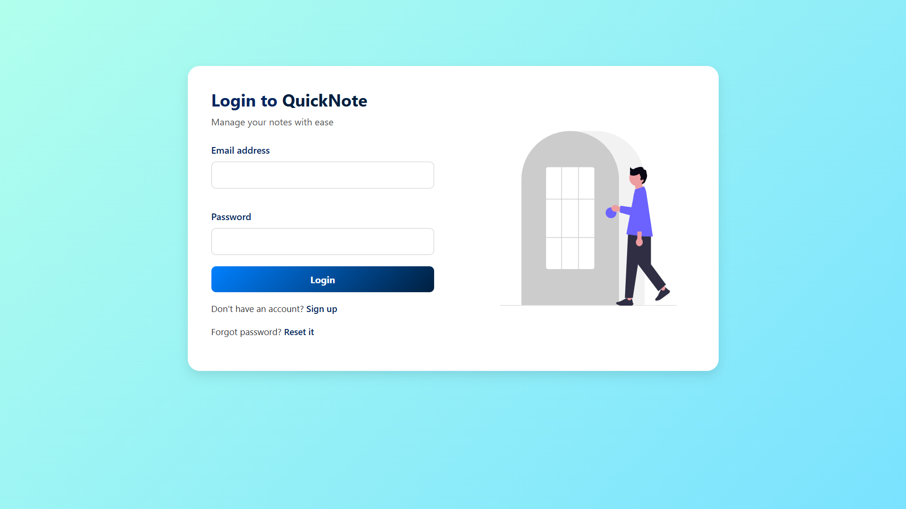
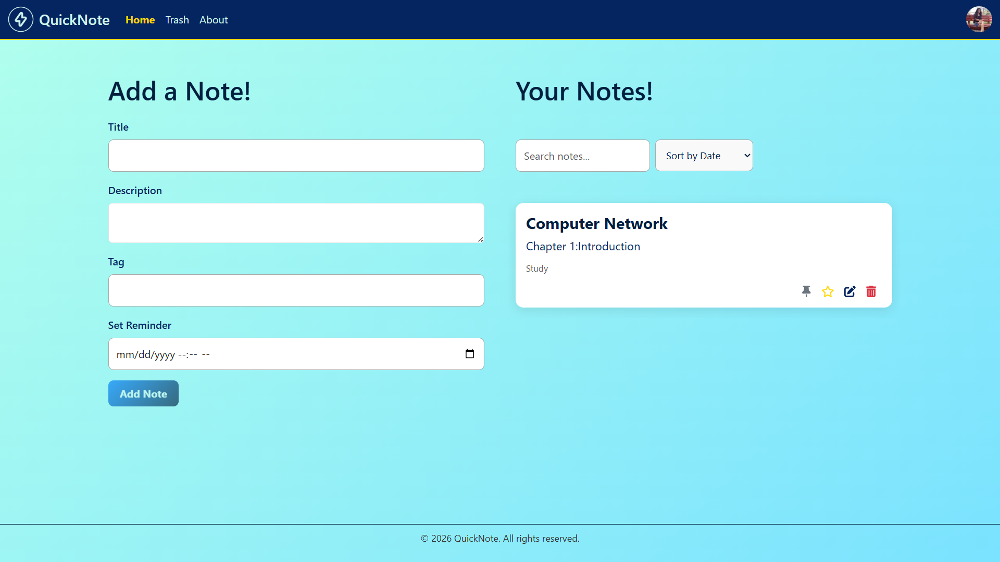
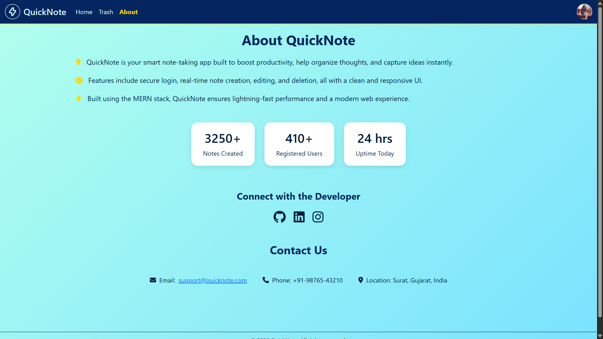
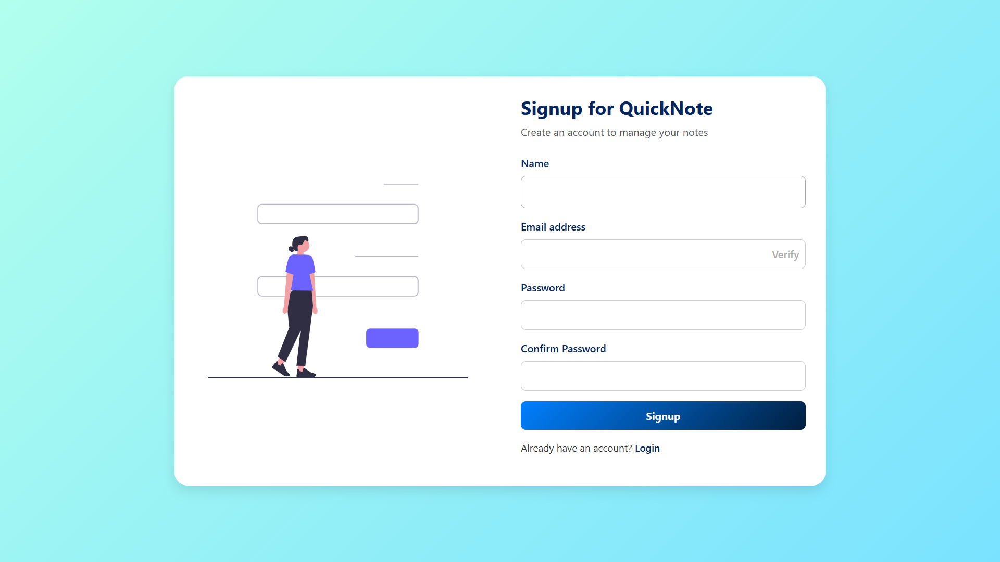
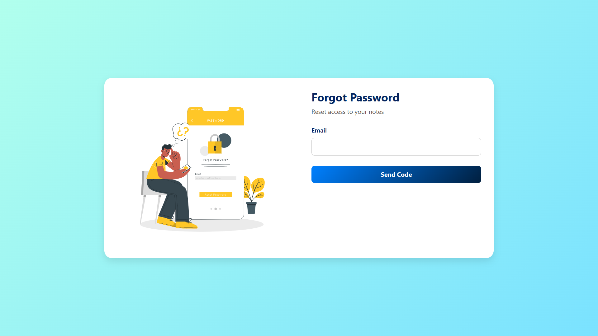

# 🚀 QuickNote

### 🔐 Secure Full-Stack MERN Note-Taking Application


> A secure and modern note-taking web application built using the MERN stack with advanced authentication, email verification, and password reset functionality.

---

## 🌟 Overview

**QuickNote** is a full-stack production-style notes application designed with security, scalability, and user experience in mind.

It includes:

* Secure authentication with JWT (Access + Refresh Tokens)
* Email verification system
* Forgot & Reset password via email code
* Protected routes
* Notes management with advanced features
* Responsive modern UI

This project demonstrates real-world backend authentication logic and frontend state management using React.

---

## ✨ Features

### 🔐 Authentication & Security

* JWT Access & Refresh Token implementation
* HttpOnly cookies
* Token refresh flow
* Rate limiting on login attempts
* Password hashing using bcrypt
* Email verification via OTP code
* Secure password reset system

### 📝 Notes Features

* Create, edit, delete notes
* Pin / Unpin important notes
* Trash & Restore notes
* Permanent delete functionality
* Sort & Filter notes
* Rich text support

### 👤 User Features

* Custom avatar upload
* Gravatar integration
* Profile management
* Secure logout
* Responsive UI design

### 🌙 UI/UX

* Dark mode toggle
* Fully responsive layout
* Clean modern design
* Illustration-based authentication pages

---

## 🛠️ Tech Stack

### Frontend

* React.js
* React Router
* Context API
* CSS3
* Fetch API

### Backend

* Node.js
* Express.js
* MongoDB
* Mongoose
* JWT (jsonwebtoken)
* bcryptjs
* Nodemailer
* Express Rate Limit

---

## 📸 Screenshots

### 🔐 Login Page


### 📝 Dashboard


### 📧 About


### 👤 Signup


### 🔁 Forgot Password

```

---

```md
## ⚙️ Installation Guide

### 1️⃣ Clone Repository

```bash
git clone https://github.com/yourusername/quicknote.git
cd quicknote
```

---

### 2️⃣ Setup Backend

```bash
cd backend
npm install
```

Create a `.env` file in backend:

```env
PORT=5000
MONGO_URI=mongodb://127.0.0.1:27017/quicknote
ACCESS_SECRET=your_access_secret
REFRESH_SECRET=your_refresh_secret
JWT_SECRET=your_jwt_secret
EMAIL_USER=your_email
EMAIL_PASS=your_app_password
CLIENT_ORIGIN=http://localhost:3000
```

Run backend:

```bash
nodemon index.js
```

---

### 3️⃣ Setup Frontend

```bash
cd ../frontend
npm install
npm start
```

---

### Or Run Both Together

From root folder:

```bash
npm run both
```

---

## 🔐 Security Architecture

QuickNote follows a secure authentication design:

* Access token (short-lived)
* Refresh token (stored in HttpOnly cookies)
* Automatic refresh mechanism
* Email verification before sensitive actions
* Password reset via time-limited OTP
* Rate limiting for login protection

---

## 🚀 Future Improvements

* Deploy to Vercel + Render
* Add Google OAuth login
* Add Markdown editor
* Add real-time sync
* Add mobile app version

---

## 👨‍💻 Author

**Ishan Mahida**

* GitHub: https://github.com/ManageMatic
* LinkedIn: https://www.linkedin.com/in/ishan-mahida-b90959338?utm_source=share&utm_campaign=share_via&utm_content=profile&utm_medium=android_app